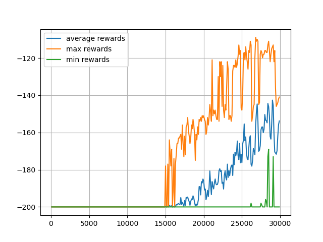
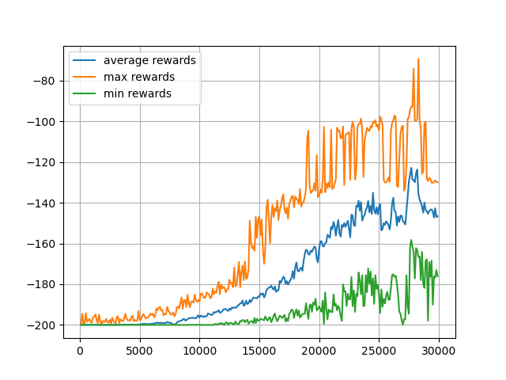
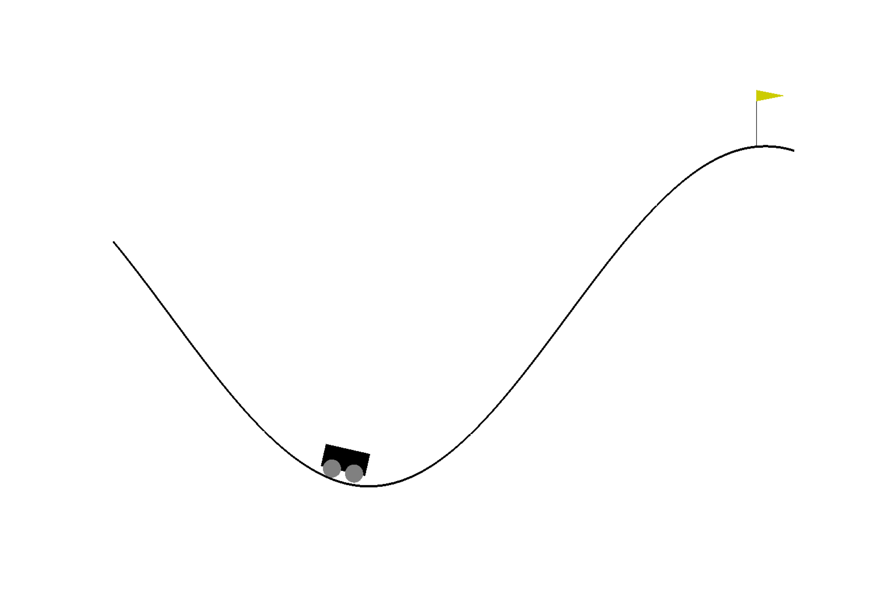

# Q-Learning Practice with Gym Environments

## Description
This repo demonstrates basic Q-learning for the [Mountain Car Gym environment](https://www.gymlibrary.dev/environments/classic_control/mountain_car/). It also shows how reward shaping can result in faster training of the agent.

---
### Environment description
The environment has a continuous observation space of two variables: the position along the x-axis and the position along the y-axis. This repo discretizes the space into a select number of bins to make it discrete. The action space is three discrete options: accelerate left, accelerate right, or do not accelerate.

The goal of the environment is to get the car to the top of the hill on the right which corresponds to a x-position greater that 0.5. The episode will also terminate after 200 steps.

### Reward description
The environment uses a sparse reward that gives the agent a reward of -1 for each time step unless the car is at the goal (x-position > 0.5) where it receives a reward of 0. 

This repo allows the user to train the agent with and without reward shaping. When the flag "USE_REWARD_SHAPING" is set to False, the program uses the native sparse reward. When the "USE_REWARD_SHAPING" flag is set to True, the program will use a reward where the agent receives 0 points if the x-position is less than the mid_point of the map (car is to the left of the mid point) and an increasing reward given by the following equation if it its x-position is greater than the mid_point (car is to the right of the mid point)

(-1 / (mid_point - goal_position)) * (x_position - goal_position)

This equation provides a reward between -1 and 0 that linearly increases from -1 at the mid_point to 0 at the goal. This gives the agent intermediate feedback that it is making progress when it sees increasing values of the x-position.

---

## Results
Training history results without reward shaping and using the native sparse reward:

Without reward shaping, the agent must "stumble" upon a good combination of actions to make it to the goal before it receives any training guidance signal. This is seen in the above graph where the agent progresses through ~15,000 episodes before it receives more than that minimum possible reward of -200 (-1 for each of the 200 steps in the episode). Once the agent happens to find the goal, that reward slowly propagates though the Q-table resulting in steady progress of increasing rewards for subsequent episodes.

This is contrasted with the agent who receives reward shaping. Here, the agent begins to receive increasing rewards the further it climbs the hill on the right (achieves a x-coordinate greater than the mid-point). It is able to use this guidance signal to learn faster.This is seen in the training progress graph below. The agent begins to achieve increasing rewards after only a few training episodes. It also achieves a greater (less negative) reward at the end of the 30,000 training episodes.

Results training with the reward shaping:

---
## Sample episode of trained agent
Another view of the value of reward shaping is from watching an episode of the trained agent. Below is a GIF of a single episode for an agent trained with and without reward shaping. The agent trained with reward shaping achieves the goal faster than the agent trained without reward shaping.

Sample episode of agent without reward shaping (native sparse reward only) after 30,000 training episodes:

Sample episode of agent with reward shaping after 30,000 training episodes:

---

## References

1. Sutton, Richard S. and Barto, Andrew G. <ins>Reinforcement Learning: An Introduction</ins>, 2nd ed. The MIT Press; Cambridge, Massachusetts. 2018
