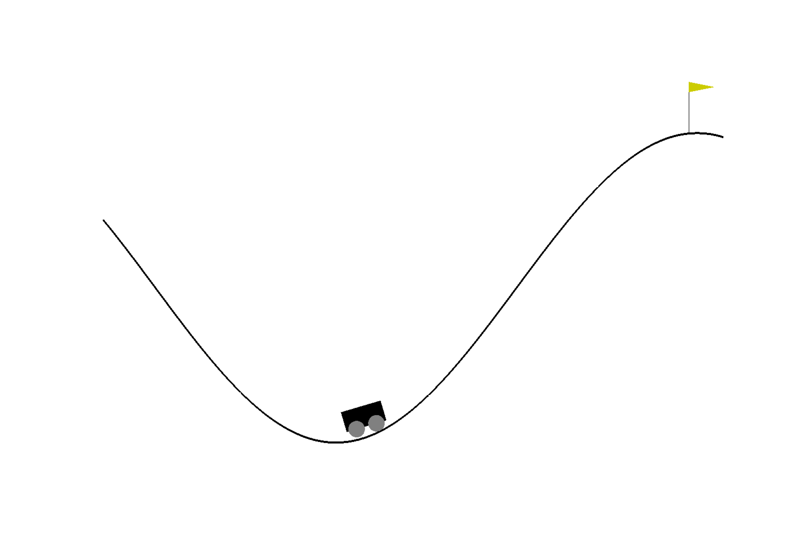

# Q-Learning Practice with Gym Environments

Basic Q-learning for the [Mountain Car Gym environment](https://www.gymlibrary.dev/environments/classic_control/mountain_car/). The environment has a continuous observation space of two variables: the position along the x-axis and the position along the y-axis. This repo discretizes the space into a select number of bins to make it discrete. The action space is three discrete options: accelerate left, accelerate right, or do not accelerate.

The goal of the environment is to get the car to the top of the hill on the right which corresponds to a x-position greater that 0.5. The episode will also terminate after 200 steps.

The environment uses a sparse reward that gives the agent a reward of -1 for each time step unless the car is at the goal (x-position > 0.5) where it receives a reward of 0. 

This repo allows the user to train the agent with and without reward shaping. When the flag "USE_REWARD_SHAPING" is set to False, the program uses the native sparse reward. When the "USE_REWARD_SHAPING" flag is set to True, the program will use a reward where the agent receives 0 points if the x-position is less than the mid_point of the map (car is to the left of the mid point) and an increasing reward given by the following equation if it its x-position is greater than the mid_point (car is to the right of the mid point)

(-1 / (mid_point - goal_position)) * (x_position - goal_position)

This equation provides a reward between -1 and 0 that linearly increases from -1 at the mid_point to 0 at the goal. This gives the agent intermediate feedback that it is making progress when it sees increasing values of the x-position.

## Results
Results training with the reward shaping:

---
## Episode of trained agent

---

## References

1. Sutton, Richard S. and Barto, Andrew G. <ins>Reinforcement Learning: An Introduction</ins>, 2nd ed. The MIT Press; Cambridge, Massachusetts. 2018
